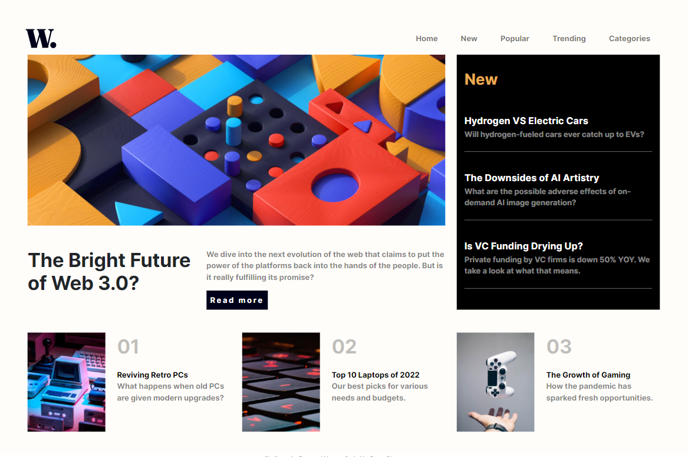
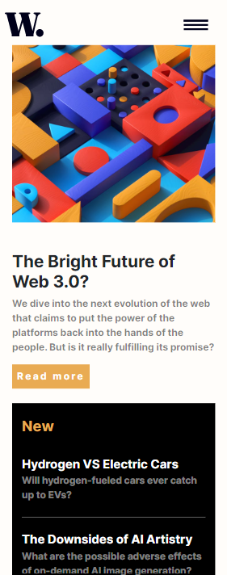
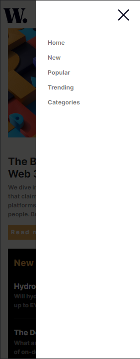
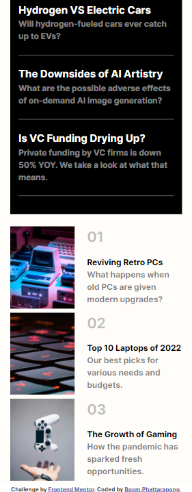

# Frontend Mentor - News homepage solution

This is a solution to the [News homepage challenge on Frontend Mentor](https://www.frontendmentor.io/challenges/news-homepage-H6SWTa1MFl). Frontend Mentor challenges help you improve your coding skills by building realistic projects. 

## Table of contents

- [Overview](#overview)
  - [The challenge](#the-challenge)
  - [Screenshot](#screenshot)
  - [Links](#links)
- [My process](#my-process)
  - [Built with](#built-with)
  - [What I learned](#what-i-learned)
  - [Useful resources](#useful-resources)

## Overview

### The challenge

Users should be able to:

- View the optimal layout for the interface depending on their device's screen size
- See hover and focus states for all interactive elements on the page
- **Bonus**: Toggle the mobile menu (requires some JavaScript)

### Screenshot

Desktop



Mobile






### Links

- Live Site URL: [Add live site URL here](https://news-homepage-main-puce.vercel.app/)

## My process

### Built with

- Semantic HTML5 markup
- CSS custom properties
- Flexbox
- CSS Grid
- Bootstrap 5

### What I learned

How to make offcanvas menu in navbar?

To see how you can add code snippets, see below:

```html
    <nav class="navbar navbar-expand-sm px-xxl-2 d-flex">
      <a class="navbar-brand" href="#"></a>
      <button class="navbar-toggler border-0" type="button" data-bs-toggle="offcanvas" data-bs-target="#offcanvasNavbar" aria-controls="offcanvasNavbar">
        
      </button>
      <div class="offcanvas offcanvas-end w-75" tabindex="-1" id="offcanvasNavbar" aria-labelledby="offcanvasNavbarLabel">
        <div class="offcanvas-header justify-content-end">
          <button type="button" class="btn" data-bs-dismiss="offcanvas" aria-label="Close">
            
          </button>
        </div>
        <div class="offcanvas-body justify-content-end align-items-md-start">
          <ul class="navbar-nav">
            <li class="nav-item px-3 fw-semibold">
              <a class="nav-link" href="#">Home</a>
            </li>
            <li class="nav-item px-3 fw-semibold">
              <a class="nav-link" href="#">New</a>
            </li>
            <li class="nav-item px-3 fw-semibold">
              <a class="nav-link" href="#">Popular</a>
            </li>
            <li class="nav-item px-3 fw-semibold">
              <a class="nav-link" href="#">Trending</a>
            </li> 
            <li class="nav-item px-3 fw-semibold">
              <a class="nav-link" href="#">Categories</a>
            </li>
          </ul>
        </div>
      </div>
    </nav>
```

### Useful resources

- [Example resource 1](https://getbootstrap.com/docs/5.2/getting-started/introduction/) - This website help me for document in boostrap 5.

